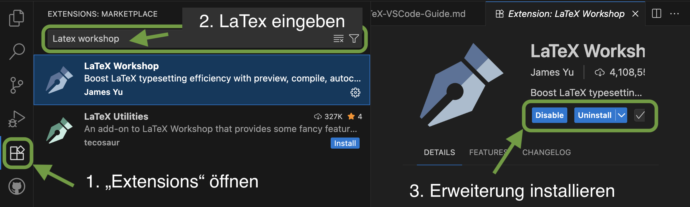
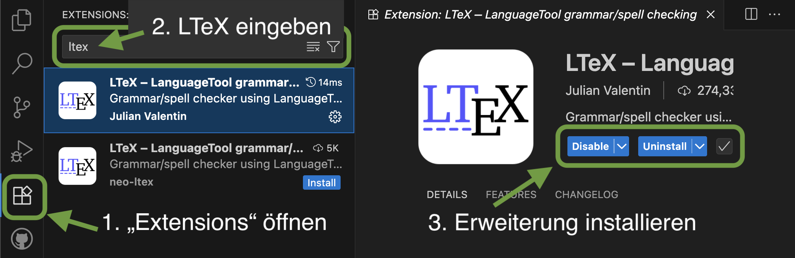
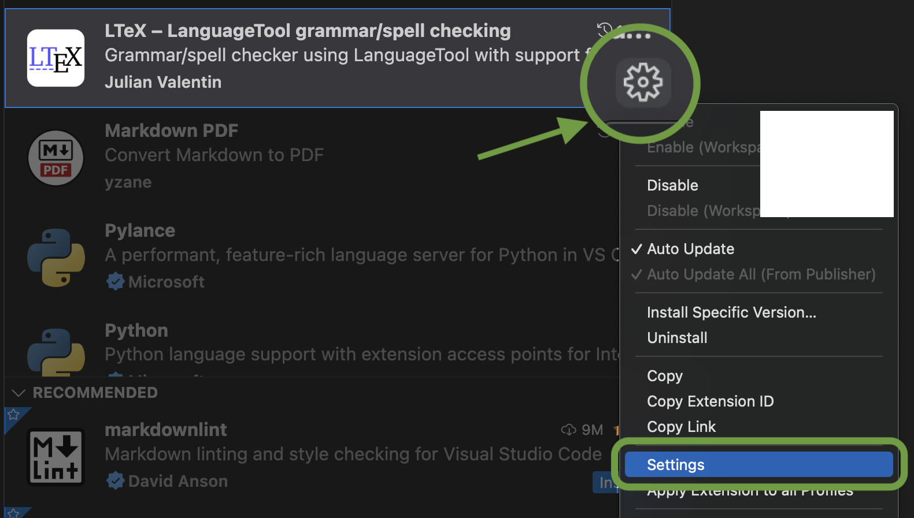
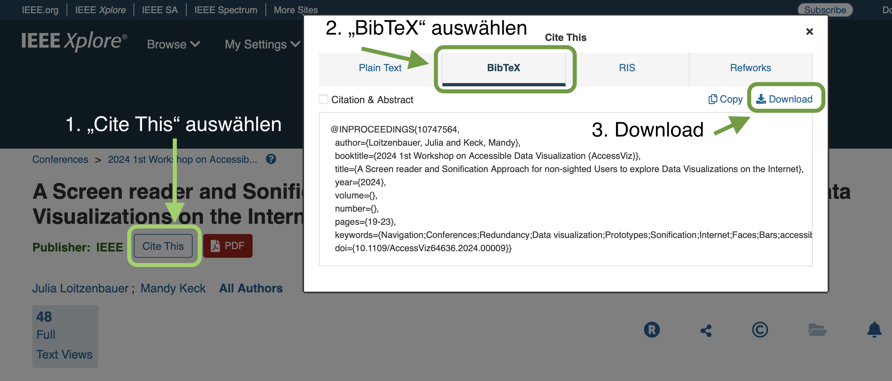
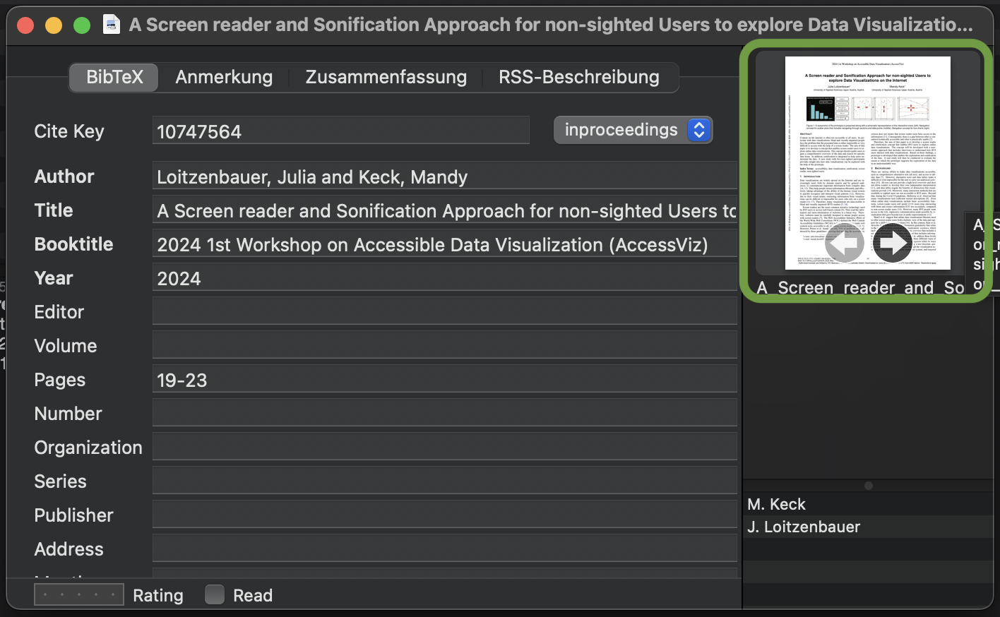

# Installationsanleitung für LaTeX in VS Code
**Erstellungsdatum**: 28. Juni 2025 
**Version**: 1.0

## Inhaltsverzeichnis
- [Einleitung](#id-section0)
- [1. Download & Installation von TeX Live](#id-section1)
- [2. Download & Installation von VS Code](#id-section2)
- [3. Installation & Konfiguration von LaTeX Workshop](#id-section3)
- [4. Installation einer Grammatikprüfung](#id-section4)
- [5. Schreiben & Kompilieren](#id-section5)
- [6. Optional: Literatursoftware](#id-section6)
    - [Verwendung MacOS](#id-section6_1)
    - [Verwendung unter Windows und Linux](#id-section6_2)
- [7. Optional: GitHub Repository](#id-section7)
- [Quellenangaben](#id-section-reference) 

## Einleitung
Diese Anleitung basiert auf einem GitHub-Beitrag von Jia Jia und wurde um mehrere Punkte erweitert. Die einzelnen Schritte wurden unter MacOS durchgeführt, wodurch Abweichungen zu anderen Betriebssystemen vorhanden sein können.

## 1. Download & Installation von TeX Live
Der Download & die Installation basiert auf dem verwendeten Betriebssystem. Dazu nachfolgend Links zu den jeweiligen Websiten. Bei der Installation sind den Angaben der Software zu folgen.
- **MacOS** Nutzer*innen: [MacTeX.pkg](https://www.tug.org/mactex/)
- **Windows & Linux** Nutzer*innen: [texlive.iso](https://www.tug.org/texlive/)

Unter Windows wird empfohlen, die ausführbare TeX Live-Datei in den System-`PATH` zu integrieren.

## 2. Download & Installation von VS Code
VS Code ist ein kostenloser Quelltext-Editor von Microsoft und kann unter folgendem Link: [VS Code](https://code.visualstudio.com/) heruntergeladen werden.

## 3. Installation & Konfiguration von LaTeX Workshop
`LaTeX Workshop` ist eine Erweiterung in VS Code.

 
*LaTeX Workshop installieren*

1. `Extensions` öffnen
2. LaTeX eingeben
3. Erweiterung installieren

Anschließend mit `Shift + Strg + P` (Windows) oder `Shift + Cmd + P` (macOS) das Befehlsmenü öffnen. Hier `Open User Settings JSON` eingeben und den ersten Eintrag, wie nachfolgend dargestellt, öffnen.

 
*LaTeX Benutzereinstellungen festlegen*

In diese JSON-Datei nun beide folgenden Schnipsel innerhalb der Klammern `{}` der Datei einfügen.

- **Schnipsel 1**: Siehe JSON-1.txt
- **Schnipsel 2**: Siehe JSON-2.txt

## 4. Installation einer Grammatikprüfung
Standardmäßig ist keine Grammatikprüfung für Markup-Sprachen integriert. Aus diesem Grund kann die VS Code-Erweiterung: `LTeX` installiert werden. Sie ermöglicht nicht nur eine grundlegende Grammatikprüfung, sondern bietet auch eine Option zur Erstellung eines eigenen Wörterbuchs, das als zusätzliche Datei dem Projekt beigefügt wird.

Zum Installieren von `LTeX` gehen Sie wie folgt vor.

 
*LTeX installieren*

Mit dem Zahnrad-Symbol neben der Erweiterung können nun die Einstellungen von `LTeX` geöffnet werden.

 
*LTeX-Einstellungen öffnen*

Es gibt verschiedene Einstellungsmöglichkeiten, wobei die wichtigste im unteren Bereich der Einstellungen zu finden ist.

 
*LTeX Sprache festlegen*

Hier kann die gewünschte Sprache ausgewählt werden. Die gewählte Sprache gilt für alle Dokumente, die in VS Code geöffnet werden. Wenn Sie in einer anderen Sprache schreiben möchten, muss diese in den Einstellungen umgestellt werden.

## 5. Schreiben & Kompilieren
Jetzt kann eine `.tex`-Datei geöffnet oder eine neue erstellt werden. Zum Kompilieren der Datei, falls dies nicht bereits automatisch geschieht, verwenden Sie `Strg + Alt + B` (Windows) oder `Option + Cmd + B` (macOS). Zudem befindet sich in der rechten oberen Ecke eine Schaltfläche zur Vorschau der PDF-Datei.

## 6. Optional: Literatursoftware
Die Installation einer Literatursoftware ist nicht zwingend nötig. Sie erleichtert jedoch das Verwalten von Quellen, die direkt im LaTeX-Dokument verwendet werden können.

### Verwendung unter MacOs
Die Verwendung der Literatursoftware ermöglicht eine schnelle Erfassung wissenschaftlicher Quellen.. Unter MacOS ist im `MacTeX.pkg` [BibDesik](https://bibdesk.sourceforge.io) standardmäßig in der Installation enthalten. Damit können Literatursammlungen, `.bib`-Dateien, einfach geöffnet und bearbeitet werden (z. B. die in den LaTeX FH-Vorlagen vorhandene `references.bib`). Des Weiteren besteht die Möglichkeit neue Sammlungen zu erstellen.

Dazu die gewünschte Literatur z. B. auf [ACM](https://dl.acm.org) oder [IEEE Xplore](https://ieeexplore.ieee.org/Xplore/home.jsp) öffnen und im oberen linken Bereich `Cite This`auswählen. Anschließend öffnet sich ein Pop-Up, in dem das gewünschte Format ausgewählt werden kann.

 
*BibTeX downloaden*

1. `Cite This` auswählen
2. `BibTeX` auswählen
3. Datei herunterladen

Unter der Nutzung von BibDesk auf MacOS kann nun die `BibTex`-Version heruntergeladen werden. Dies kann anschließend in BibDesk unter `Puplikation` > `Neue Puplikation aus Datei ...` in die aktuelle Sammlung hinzugefügt werden. Anschließend kann in der Quelle der `Cite Key` noch angepasst werden (siehe z. B. LaTeX FH-Vorlage), damit die weitere Arbeit damit erleichtert wird.

Nach der Integration der Quelle kann das zugehörige PDF per "Drag and Drop" mit der Quelle verknüpft werden. Dazu das PDF in das markierte Vorschaufenster in der nachfolgenden Abbildung ziehen. Hierbei ist zu beachten, dass sich dabei der Speicherort der PDF nicht verändert.

 
*PDF in BibDesk einbinden*

### Verwendung unter Windows und Linux
Da diese Anleitung unter MacOS erstellt wurde, kann nicht garantiert werden, dass die zuvor beschriebenen Schritte identisch sind. Aus diesem Grund nachfolgend alternative Verlinkungen zu möglichen Literatursoftware-Optionen.
- [Zotero](https://www.zotero.org)
    - [Interessante Zotero Erweiterung](https://github.com/retorquere/zotero-better-bibtex)
- [JabRef](https://www.jabref.org)

Bei Fragen zur Verwendung der genannten Software wird auf die jeweilige Dokumentation verwiesen.

## 7. Optional: GitHub Repository
Damit die erstellten Daten nun nicht verloren gehen, wird empfohlen ein GitHub-`Repository` zu erstellen. Dies eröffnet zudem die Möglichkeit, auf mehreren Geräten am Dokument zu arbeiten und dabei nicht die Übersicht zu verlieren.

Zur Erstellung einer Repository wird zuerst ein kostenloses Konto auf [GitHub](https://github.com) benötigt. Anschließend gibt es mehrere Möglichkeiten, ein Repository zu erstellen. Aufgrund des Umfangs wird dabei auf die offizielle Dokumentation von GitHub verwiesen. Zur einfacheren Umsetzung kann zudem die Software **GitHub Desktop** installiert werden. Diese nimmt die Konsolenbefehle ab und bietet eine Übersicht über die verknüpften Repositorys sowie deren aktuellen Stand.

Im Zusammenhang mit einem `Repository` ist es geläufig, eine `.gitignore`-Datei im jeweiligen Ordner zu integrieren. Diese beinhaltet Muster, die Git mitteilen, welche Dateien und Verzeichnisse ignoriert werden sollen. Als Basis nochfolgend ein Muster, das nicht benötigte System-/LaTeX- und BibTeX-Dateien ignoriert. Dazu eine `.gitignore`-Datei im Ordner erstellen und Inhalt hinein kopieren.

**HINWEIS**: Die `.gitignore`-Datei muss vor dem ersten Commit/Upload vorhanden sein, um diese Daten von Beginn an auszuschließen. Andernfalls müssen diese nachträglich auf GitHub gelöscht werden.

- **.gitignore**: Siehe gitignore.txt

**Verweis auf die Offizielle Dokumentation & GitHub Desktop**
- [Ein neues Repository erstellen](https://docs.github.com/de/repositories/creating-and-managing-repositories/creating-a-new-repository)
- [GitHub Desktop](https://github.com/apps/desktop)

## Quellenangaben
Diese Anleitung basiert auf dem GitHub-Beitrag von Jia Jia (贾甲). 
Link zum Beitrag: [A Fast Guide on Writing LaTeX with LaTeX Workshop in VS Code](https://mathjiajia.github.io/vscode-and-latex/)

Autor: Dominik Altmann (HCC-Studiengang, FH Hagenberg)

---

*Dieses Dokument wurde im Interesse von Studierenden für Studierende erstellt und steht in keinem Zusammenhang mit der FH Hagenberg. Jeglicher Inhalt basiert auf persönlicher Erfahrung oder den in den Quellenangaben genannten Ressourcen. Aus diesem Grund gilt die Nutzung auf eigene Verantwortung.*